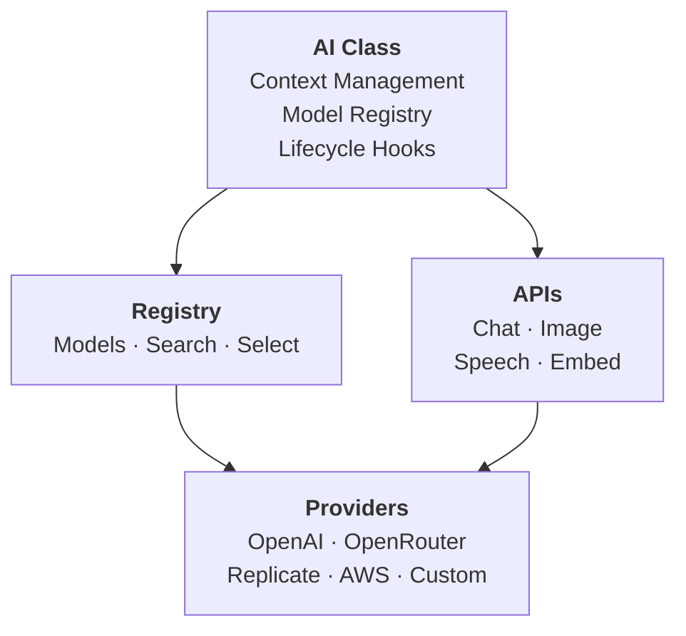

# @aeye - AI

> **Multi-provider AI library with intelligent model selection, type-safe context management, and comprehensive provider support.**

@aeye (AI TypeScript) is a modern, type-safe AI library for Node.js and TypeScript applications. It provides a unified interface for working with multiple AI providers (OpenAI, OpenRouter, Replicate, AWS Bedrock, and more) with automatic model selection, cost tracking, streaming support, and extensible architecture.

[Documentation](https://clickermonkey.github.io/aeye/)

To see a complex example of a CLI agent built with aeye - `npm i -g @aeye/cletus` and run `cletus`!

For a higher-level "build with types" experience, check out **[@aeye/gin](./packages/gin)** (a JSON-typed, executable program language for LLMs) and **[@aeye/ginny](./packages/ginny)** (a CLI that turns natural-language requests into validated gin programs) — `npm i -g @aeye/ginny` and run `ginny`.

```ts
import { AI } from '@aeye/ai';
import { OpenAIProvider } from '@aeye/openai';

const openai = new OpenAIProvider({ apiKey: process.env.OPENAI_API_KEY! });
const ai = AI.with<MyContext>().providers({ openai }).create({ /* config */ });

const myTool = ai.tool({ /* name, description, instructions, schema, call, + */ });
const myPrompt = ai.prompt({ /* name, description, content, schema?, config, tools, metadata, + */ });
const myAgent = ai.agent({ /* name, description, refs, call, + */ });

myTool.run(input, ctx?);          // run a tool
myPrompt.run(input, ctx?);        // run a prompt (streaming generator)
myPrompt.get('result', input, ctx?); // get structured result
myPrompt.get('stream', input, ctx?); // stream all events
myAgent.run(input, ctx?);         // run an agent

ai.chat.get(request, ctx?);          // or .stream(request, ctx?)
ai.image.generate.get(request, ctx?); // or .stream(request, ctx?)
ai.image.edit.get(request, ctx?);     // or .stream(request, ctx?)
ai.image.analyze.get(request, ctx?);  // or .stream(request, ctx?)
ai.speech.get(request, ctx?);         // or .stream(request, ctx?)
ai.transcribe.get(request, ctx?);     // or .stream(request, ctx?)
ai.embed.get(request, ctx?);
ai.models.list(); // .get(id), .search(criteria), .select(criteria), .refresh()
```

## Features

### Core Features

- 🎯 **Multi-Provider Support** - Single interface for OpenAI, OpenRouter, Replicate, AWS Bedrock, and custom providers
- 🤖 **Intelligent Model Selection** - Automatic model selection based on capabilities, cost, speed, and quality
- 💰 **Cost Tracking** - Built-in token usage and cost calculation with provider-reported costs
- 🔄 **Streaming Support** - Full streaming support across all compatible capabilities
- 🛡️ **Type-Safe** - Strongly-typed context and metadata with compiler validation
- 🎨 **Comprehensive APIs** - Chat, Image Generation, Speech Synthesis, Transcription, Embeddings
- 🔌 **Extensible** - Custom providers, model handlers, and transformers
- 📊 **Model Registry** - Centralized model management with external sources

### Advanced Features

- 🤖 **Tools, Prompts & Agents** - Composable components for building sophisticated AI workflows
- 🎣 **Lifecycle Hooks** - Intercept and modify operations at every stage
- 🔧 **Model Overrides** - Customize model properties without modifying providers
- 📦 **Model Sources** - External model sources (OpenRouter, custom APIs)
- 🌊 **Context Management** - Thread context through your entire AI operation
- 🎛️ **Fine-Grained Control** - Temperature, tokens, stop sequences, tool calling, and more

## Quick Start

### Installation

```bash
# Install core packages
npm install @aeye/ai @aeye/core

# Install provider packages as needed
npm install @aeye/openai openai       # OpenAI
npm install @aeye/openrouter          # OpenRouter (multi-provider)
npm install @aeye/replicate replicate # Replicate
npm install @aeye/aws                 # AWS
```

### Basic Usage

```typescript
import { AI } from '@aeye/ai';
import { OpenAIProvider } from '@aeye/openai';

// Create providers
const openai = new OpenAIProvider({
  apiKey: process.env.OPENAI_API_KEY!
});

// Create AI instance
const ai = AI.with()
  .providers({ openai })
  .create();

// Chat completion
const response = await ai.chat.get({
  messages: [{ role: 'user', content: 'What is TypeScript?' }]
});
console.log(response.content);

// Streaming
for await (const chunk of ai.chat.stream({
  messages: [{ role: 'user', content: 'Write a poem about AI' }]
})) {
  if (chunk.content) {
    process.stdout.write(chunk.content);
  }
}
```

### Multi-Provider Setup

```typescript
import { AI } from '@aeye/ai';
import { OpenAIProvider } from '@aeye/openai';
import { OpenRouterProvider } from '@aeye/openrouter';
import { ReplicateProvider } from '@aeye/replicate';
import { AWSBedrockProvider } from '@aeye/aws';

const openai = new OpenAIProvider({ apiKey: process.env.OPENAI_API_KEY! });
const openrouter = new OpenRouterProvider({ apiKey: process.env.OPENROUTER_API_KEY! });
const replicate = new ReplicateProvider({ apiKey: process.env.REPLICATE_API_KEY! });
const aws = new AWSBedrockProvider({ region: 'us-east-1' });

const ai = AI.with()
  .providers({ openai, openrouter, replicate, aws })
  .create({
    // Default scoring weights for automatic model selection
    defaultWeights: {
      cost: 0.4,
      speed: 0.3,
      accuracy: 0.3,
    }
  });

// AI automatically selects the best provider/model
const response = await ai.chat.get({
  messages: [{ role: 'user', content: 'Explain quantum computing' }]
});
```

## Architecture



## Packages

### Core Packages

#### [@aeye/core](./packages/core/README.md)
Core primitives for building AI agents, tools, and prompts with TypeScript. Provides the foundational `Tool`, `Prompt`, and `Agent` classes along with all shared types.

```bash
npm install @aeye/core
```

#### [@aeye/ai](./packages/ai/README.md)
Main AI library with intelligent model selection, context management, and comprehensive APIs. Built on top of @aeye/core.

```bash
npm install @aeye/ai @aeye/core
```

### Provider Packages

#### [@aeye/openai](./packages/openai)
OpenAI provider supporting chat completions, image generation, speech synthesis, transcription, and embeddings. Also serves as a base class for OpenAI-compatible providers.

```bash
npm install @aeye/openai openai
```

**Features:**
- Chat completions with vision support
- Reasoning models
- Image generation and editing
- Speech-to-text (transcription)
- Text-to-speech
- Embeddings
- Tool/function calling
- Structured outputs

#### [@aeye/openrouter](./packages/openrouter)
OpenRouter provider for unified access to hundreds of AI models from multiple providers with competitive pricing.

```bash
npm install @aeye/openrouter
```

**Features:**
- Access to models from OpenAI, Anthropic, Google, Meta, and more
- Automatic fallbacks
- Built-in cost tracking
- Zero Data Retention (ZDR) support
- Provider routing preferences

#### [@aeye/replicate](./packages/replicate)
Replicate provider with flexible adapter system for running open-source AI models.

```bash
npm install @aeye/replicate replicate
```

**Features:**
- Thousands of open-source models
- Model adapters for handling diverse schemas
- Image generation, transcription, embeddings
- Custom model support

#### [@aeye/aws](./packages/aws)
AWS Bedrock provider supporting a wide range of foundation models via the Converse API.

```bash
npm install @aeye/aws
```

**Features:**
- Chat completions with models from Anthropic, Meta, Mistral, Amazon, and more
- Image generation (Stability AI)
- Text embeddings (Amazon Titan)
- Automatic AWS credential discovery

### Higher-Level Packages

#### [@aeye/gin](./packages/gin)
A JSON-based programming language and type system designed for LLMs to author, validate, and execute typed programs at runtime. Gives the model a real type system (generics, structural compatibility, extension-based inheritance) and an expression language serialized as plain JSON — programs round-trip through `JSON.stringify` / `JSON.parse`, can be introspected and validated without running them, and execute in-process against a pluggable registry of native functions.

```bash
npm install @aeye/gin zod
```

**Features:**
- Typed expressions (`get`, `set`, `define`, `loop`, `if`, `switch`, `lambda`, `flow`, `native`, …) authored as JSON
- Static `validate()` catches unknown vars, prop / type mismatches, out-of-place flow before execution
- Generics with constraints (not defaults), structural type compatibility, type augmentation via `registry.augment(...)`
- Sequential and parallel loops over lists, maps, objs, text, num — plus dynamic (bool while-loop) iteration that composes with parallelism

#### [@aeye/ginny](./packages/ginny)
CLI agent that turns natural-language requests into executable gin programs. Multi-prompt orchestration (programmer → designer → architect → researcher → DBA) drafts, validates, and persists reusable typed functions and variables to disk, with a path-callable native fn surface (`fns.fetch`, `fns.llm`, `fns.log`, `fns.ask`) and optional Tavily-powered web research.

```bash
npm install -g @aeye/ginny
ginny
```

**Features:**
- REPL with conversation history, ESC-to-interrupt, Ctrl+C exit
- Per-prompt model overrides via `GIN_<KEY>_MODEL` env vars (programmer, researcher, architect, designer, dba, llm)
- Fn / type / var catalog persisted as JSON under `./fns`, `./types`, `./vars` for reuse across sessions
- Works with any provider configured for `@aeye/ai` — OpenAI, OpenRouter, AWS Bedrock; web research via Tavily

#### [@aeye/query](./packages/query)
An LLM-authorable relational query language, in-memory runtime, and SQL converter. You register *Types* (table-like entities) with *Fields*; an LLM builds a typed, validated, runnable query (select / insert / update / delete / set-op / CTE) as plain JSON against a depth-graduated, capability-gated schema. Standalone (depends only on `zod`).

```bash
npm install @aeye/query zod
```

**Features:**
- Typed queries with relation-path joins, aggregates / grouping / window functions, set operations, recursive CTEs, and DML with `ON CONFLICT`
- Runs in-memory AND emits dialect SQL (base ANSI + Postgres) identically; cost estimation, auto-pagination, and aggregate drill-down
- Semantic + full-text search with numeric scoring / ranking (cross-Type pairing, `ts_rank`), array fields, and a 60+ function library (`e.*` builder)
- Type *backing* keeps the model's schema minimal while RLS / FLS / computed fields / hidden vector columns live in dev-side code
- `buildQueryTool` returns a ready-wired `@aeye/core` `Tool` whose custom `parse` replaces Zod with compiler-style diagnostics

## Usage Examples

### Chat Completion

```typescript
import { AI } from '@aeye/ai';
import { OpenAIProvider } from '@aeye/openai';

const openai = new OpenAIProvider({ apiKey: process.env.OPENAI_API_KEY! });
const ai = AI.with().providers({ openai }).create();

const response = await ai.chat.get({
  messages: [{ role: 'user', content: 'What is TypeScript?' }]
});
console.log(response.content);
```

### Image Generation

```typescript
const imageResponse = await ai.image.generate.get({
  prompt: 'A serene mountain landscape at sunset',
  size: '1024x1024',
  quality: 'high'
});

console.log('Image URL:', imageResponse.images[0].url);
```

### Tool Calling with `ai.tool()` and `ai.prompt()`

The recommended way to use tools is through the `ai.tool()` and `ai.prompt()` factories, which bind your components to the AI instance:

```typescript
import { AI } from '@aeye/ai';
import { OpenAIProvider } from '@aeye/openai';
import z from 'zod';

const openai = new OpenAIProvider({ apiKey: process.env.OPENAI_API_KEY! });
const ai = AI.with().providers({ openai }).create();

// Define a tool
const getWeather = ai.tool({
  name: 'getWeather',
  description: 'Get current weather for a city',
  instructions: 'Use this tool to fetch current weather data for {{location}}.',
  schema: z.object({
    location: z.string().describe('City name, e.g. "San Francisco"'),
    units: z.enum(['celsius', 'fahrenheit']).default('celsius'),
  }),
  call: async ({ location, units }) => {
    // In a real app, call a weather API here
    return { temperature: 18, condition: 'sunny', units };
  },
});

// Create a prompt that uses the tool
const weatherAdvisor = ai.prompt({
  name: 'weatherAdvisor',
  description: 'Gives travel clothing advice based on weather',
  content: 'You are a helpful travel advisor. The user is visiting {{destination}}. Check the weather and suggest what to wear.',
  input: (input: { destination: string }) => ({ destination: input.destination }),
  tools: [getWeather],
  schema: z.object({
    suggestion: z.string().describe('Clothing and packing suggestion'),
    temperature: z.number().describe('Current temperature'),
    condition: z.string().describe('Weather condition'),
  }),
});

// The prompt automatically calls the weather tool and returns structured output
const advice = await weatherAdvisor.get('result', { destination: 'Paris' });
console.log(advice?.suggestion);  // "Bring a light jacket, it's 18°C and sunny."
```

### Agent Orchestration

Agents coordinate multiple tools and prompts to accomplish complex goals:

```typescript
import { AI } from '@aeye/ai';
import { OpenAIProvider } from '@aeye/openai';
import z from 'zod';

const openai = new OpenAIProvider({ apiKey: process.env.OPENAI_API_KEY! });
const ai = AI.with().providers({ openai }).create();

// Define individual tools
const searchFiles = ai.tool({
  name: 'searchFiles',
  description: 'Search for files matching a glob pattern',
  schema: z.object({
    pattern: z.string().describe('Glob pattern, e.g. "**/*.ts"'),
  }),
  call: async ({ pattern }) => {
    // Return matching file paths
    return { files: [`src/index.ts`, `src/app.ts`] };
  },
});

const readFile = ai.tool({
  name: 'readFile',
  description: 'Read the contents of a file',
  schema: z.object({
    path: z.string().describe('File path to read'),
  }),
  call: async ({ path }) => {
    // Return file contents
    return { content: `// Contents of ${path}` };
  },
});

const summarizeCode = ai.prompt({
  name: 'summarizeCode',
  description: 'Summarizes TypeScript code',
  content: 'Summarize the following TypeScript code:\n\n{{code}}',
  input: (input: { code: string }) => ({ code: input.code }),
  schema: z.object({
    summary: z.string(),
    exports: z.array(z.string()),
  }),
});

// Agent that finds, reads, and summarizes code files
const codeReviewer = ai.agent({
  name: 'codeReviewer',
  description: 'Reviews TypeScript files and produces summaries',
  refs: [searchFiles, readFile, summarizeCode] as const,
  call: async ({ pattern }: { pattern: string }, [search, read, summarize], ctx) => {
    const { files } = await search.run({ pattern }, ctx);
    const summaries: Array<{ file: string; summary: string; exports: string[] }> = [];

    for (const file of files) {
      const { content } = await read.run({ path: file }, ctx);
      const result = await summarize.get('result', { code: content }, ctx);
      summaries.push({ file, summary: result?.summary ?? '', exports: result?.exports ?? [] });
    }

    return summaries;
  },
});

const results = await codeReviewer.run({ pattern: 'src/**/*.ts' });
results.forEach(({ file, summary }) => console.log(`${file}: ${summary}`));
```

### Fun Examples Inspired by Cletus

Here are some examples inspired by the [Cletus](./packages/cletus/README.md) CLI agent to show how Tools, Agents, and Prompts work together:

#### To-Do Manager Tools

```typescript
import { AI } from '@aeye/ai';
import { OpenAIProvider } from '@aeye/openai';
import z from 'zod';

interface AppContext {
  userId: string;
  db: { todos: Map<string, { id: string; name: string; done: boolean }> };
}

const openai = new OpenAIProvider({ apiKey: process.env.OPENAI_API_KEY! });
const ai = AI.with<AppContext>().providers({ openai }).create();

const addTodo = ai.tool({
  name: 'addTodo',
  description: 'Add a new to-do item',
  schema: z.object({
    name: z.string().describe('The to-do item description'),
  }),
  call: async ({ name }, _refs, ctx) => {
    const id = crypto.randomUUID();
    ctx.db.todos.set(id, { id, name, done: false });
    return { id, name, done: false };
  },
});

const listTodos = ai.tool({
  name: 'listTodos',
  description: 'List all to-do items',
  schema: z.object({}),
  call: async (_input, _refs, ctx) => {
    return { todos: Array.from(ctx.db.todos.values()) };
  },
});

const markDone = ai.tool({
  name: 'markDone',
  description: 'Mark a to-do item as complete',
  schema: z.object({
    id: z.string().describe('The to-do item ID'),
  }),
  call: async ({ id }, _refs, ctx) => {
    const todo = ctx.db.todos.get(id);
    if (!todo) throw new Error(`Todo ${id} not found`);
    todo.done = true;
    return { success: true, todo };
  },
});

// A prompt that uses all three tools
const taskManager = ai.prompt({
  name: 'taskManager',
  description: 'Manages to-do items via natural language',
  content: `You are a helpful task manager assistant. Help the user manage their to-do list.

User request: {{request}}`,
  input: (input: { request: string }) => ({ request: input.request }),
  tools: [addTodo, listTodos, markDone],
});

// Usage
const db = { todos: new Map() };
await taskManager.get('result', { request: 'Add a todo to finish the report' }, { userId: 'user1', db });
```

#### Knowledge Base with Semantic Search

```typescript
import { AI } from '@aeye/ai';
import { OpenAIProvider } from '@aeye/openai';
import z from 'zod';

const openai = new OpenAIProvider({ apiKey: process.env.OPENAI_API_KEY! });
const ai = AI.with().providers({ openai }).create();

const searchKnowledge = ai.tool({
  name: 'searchKnowledge',
  description: 'Semantically search the knowledge base',
  instructions: 'Use this to find relevant information in the knowledge base for the query: "{{query}}"',
  schema: z.object({
    query: z.string().describe('Search query'),
    limit: z.number().optional().describe('Max results (default 5)'),
  }),
  input: (ctx) => ({ query: '' }), // template variable for instructions
  call: async ({ query, limit = 5 }) => {
    // In a real app, use vector embeddings and similarity search
    return { results: [{ source: 'docs/api.md', text: 'API documentation...' }] };
  },
});

const knowledgeAssistant = ai.prompt({
  name: 'knowledgeAssistant',
  description: 'Answers questions using the knowledge base',
  content: `You are a helpful assistant. Use the searchKnowledge tool to find relevant information, then answer the user's question.

Question: {{question}}`,
  input: (input: { question: string }) => ({ question: input.question }),
  tools: [searchKnowledge],
});

const answer = await knowledgeAssistant.get('result', {
  question: 'How do I configure the API timeout?'
});
console.log(answer);
```

### AI Hooks — Budget Control

Hooks let you intercept every AI call. Here's how to check estimated cost before running and record actual cost after, using a user budget from context:

```typescript
import { AI } from '@aeye/ai';
import { OpenAIProvider } from '@aeye/openai';

interface User {
  id: string;
  budgetRemaining: number;  // in dollars
  totalSpent: number;
  save: () => Promise<void>;
}

interface AppContext {
  user: User;
}

const openai = new OpenAIProvider({ apiKey: process.env.OPENAI_API_KEY! });

const ai = AI.with<AppContext>()
  .providers({ openai })
  .create({
    hooks: {
      beforeRequest: async (ctx, request, selected, estimatedUsage, estimatedCost) => {
        // Throw to cancel the request if the estimated cost exceeds the user's budget
        if (estimatedCost > ctx.user.budgetRemaining) {
          throw new Error(
            `Request cancelled: estimated cost $${estimatedCost.toFixed(4)} exceeds ` +
            `remaining budget $${ctx.user.budgetRemaining.toFixed(4)}`
          );
        }
        console.log(
          `[${ctx.user.id}] Using ${selected.model.id}, ` +
          `estimated cost: $${estimatedCost.toFixed(4)}`
        );
      },

      afterRequest: async (ctx, request, response, responseComplete, selected, usage, cost) => {
        // Deduct actual cost from user's budget and record spending
        ctx.user.budgetRemaining -= cost;
        ctx.user.totalSpent += cost;
        await ctx.user.save();
        console.log(
          `[${ctx.user.id}] Used ${usage.text?.input ?? 0} in / ${usage.text?.output ?? 0} out tokens, ` +
          `cost: $${cost.toFixed(4)}, budget remaining: $${ctx.user.budgetRemaining.toFixed(4)}`
        );
      },

      onError: (errorType, message, error, ctx) => {
        console.error(`[AI Error] ${errorType}: ${message}`, error?.message);
      },
    }
  });

// Chat with budget enforcement
const user: User = {
  id: 'user123',
  budgetRemaining: 0.05,
  totalSpent: 0,
  save: async () => { /* persist to database */ },
};

const response = await ai.chat.get(
  { messages: [{ role: 'user', content: 'Explain monads in simple terms' }] },
  { user }
);
console.log(response.content);
```

### Model Selection

```typescript
// Explicit model selection via metadata
const response = await ai.chat.get(
  { messages: [{ role: 'user', content: 'Hello' }] },
  { metadata: { model: 'openai/gpt-4o' } }
);

// Automatic selection with scoring weights
const precise = await ai.chat.get(
  { messages: [{ role: 'user', content: 'Analyze this code' }] },
  {
    metadata: {
      weights: { cost: 0.2, speed: 0.3, accuracy: 0.5 },
      contextWindow: { min: 32000 },
    }
  }
);

// Provider filtering
const costEfficient = await ai.chat.get(
  { messages: [{ role: 'user', content: 'Summarize this' }] },
  {
    metadata: {
      providers: {
        allow: ['openai', 'openrouter'],
        deny: ['replicate'],
      }
    }
  }
);
```

### Speech Synthesis

```typescript
import fs from 'fs';
import { Readable } from 'stream';

const response = await ai.speech.get({
  text: 'Hello! This is a text-to-speech example.',
  voice: 'alloy',
});

// Pipe the audio stream to a file
const fileStream = fs.createWriteStream('output.mp3');
Readable.fromWeb(response.audio).pipe(fileStream);
```

### Audio Transcription

```typescript
import fs from 'fs';

const audioBuffer = fs.readFileSync('audio.mp3');

const transcription = await ai.transcribe.get({
  audio: audioBuffer,
  language: 'en',
});

console.log('Transcription:', transcription.text);
```

### Embeddings

```typescript
const embeddingResponse = await ai.embed.get({
  texts: [
    'The quick brown fox jumps over the lazy dog',
    'Machine learning is a subset of artificial intelligence',
  ],
});

embeddingResponse.embeddings.forEach((item, i) => {
  console.log(`Embedding ${i}:`, item.embedding.length, 'dimensions');
});
```

### Context Management

```typescript
interface AppContext {
  userId: string;
  sessionId: string;
}

const ai = AI.with<AppContext>()
  .providers({ openai })
  .create({
    providedContext: async (ctx) => ({
      // Automatically enrich context from the database
      // (user and session data are fetched here and available in hooks/tools)
    }),
  });

const response = await ai.chat.get(
  { messages: [{ role: 'user', content: 'Hello!' }] },
  { userId: 'user123', sessionId: 'session456' }
);
```

## Advanced Features

### Custom Providers

Create custom providers by extending existing providers:

```typescript
import { OpenAIProvider, OpenAIConfig } from '@aeye/openai';
import OpenAI from 'openai';

class CustomProvider extends OpenAIProvider {
  readonly name = 'custom';

  protected createClient(config: OpenAIConfig) {
    return new OpenAI({
      apiKey: config.apiKey,
      baseURL: 'https://custom-api.example.com/v1',
    });
  }
}
```

### Model Sources

Fetch models from external sources:

```typescript
import { OpenRouterModelSource } from '@aeye/openrouter';

const source = new OpenRouterModelSource({
  apiKey: process.env.OPENROUTER_API_KEY,
});

const ai = AI.with()
  .providers({ openrouter })
  .create({
    modelSources: [source],
  });
```

### Model Overrides

Customize model properties:

```typescript
const ai = AI.with()
  .providers({ openai })
  .create({
    modelOverrides: [
      {
        modelPattern: /gpt-4/,
        overrides: {
          pricing: {
            text: { input: 30, output: 60 },
          },
        },
      },
    ],
  });
```

## Cost Tracking

@aeye provides comprehensive cost tracking:

```typescript
const response = await ai.chat.get({
  messages: [{ role: 'user', content: 'Hello' }]
});

// Token usage
console.log('Input tokens:', response.usage?.text?.input);
console.log('Output tokens:', response.usage?.text?.output);

// Cost (calculated from model pricing, or provider-reported when available)
console.log('Cost: $', response.usage?.cost);
```

## Development

### Building

```bash
# Install dependencies
npm install

# Build all packages
npm run build

# Run tests
npm run test

# Clean build artifacts
npm run clean
```

### Project Structure

```
aeye/
├── packages/
│   ├── core/          # Core types, Tool, Prompt, Agent
│   ├── ai/            # Main AI library
│   ├── openai/        # OpenAI provider
│   ├── openrouter/    # OpenRouter provider
│   ├── replicate/     # Replicate provider
│   ├── aws/           # AWS Bedrock provider
│   ├── gin/           # JSON-typed program language for LLMs
│   ├── ginny/         # CLI agent that authors gin programs
│   ├── query/         # LLM-authorable relational query language + SQL converter
│   └── cletus/        # Example CLI agent
├── package.json       # Root package configuration
└── tsconfig.json      # TypeScript configuration
```

## Best Practices

1. **API Key Security** - Never hardcode API keys, use environment variables

2. **Streaming** - Use streaming for better UX with lengthy responses

3. **Cost Monitoring** - Use `afterRequest` hooks to track expenses per user

4. **Budget Enforcement** - Throw from `beforeRequest` to cancel overbudget requests

5. **Context Management** - Use `providedContext` to enrich context from databases

6. **Provider Selection** - Choose providers based on:
   - Cost efficiency
   - Feature availability
   - Reliability/uptime
   - Privacy requirements (ZDR)

## Roadmap

- [ ] Built-in retry logic with exponential backoff
- [ ] Rate limiting utilities

## Contributing

Contributions are welcome! Areas where we'd especially appreciate help:

- **New Providers** - Google, Cohere, etc.
- **Model Adapters** - For Replicate and other platforms
- **Documentation** - Examples, tutorials, guides
- **Testing** - Unit tests, integration tests
- **Bug Fixes** - Issue reports and fixes

Please see the main [@aeye repository](https://github.com/ClickerMonkey/aeye) for contribution guidelines.

## License

GPL-3.0 © [ClickerMonkey](https://github.com/ClickerMonkey)

See [LICENSE](./LICENSE) for details.

## Support

- **GitHub Issues**: https://github.com/ClickerMonkey/aeye/issues
- **Documentation**: https://github.com/ClickerMonkey/aeye

---

**Made with TypeScript** | **GPL-3.0 Licensed** | **Production Ready**
