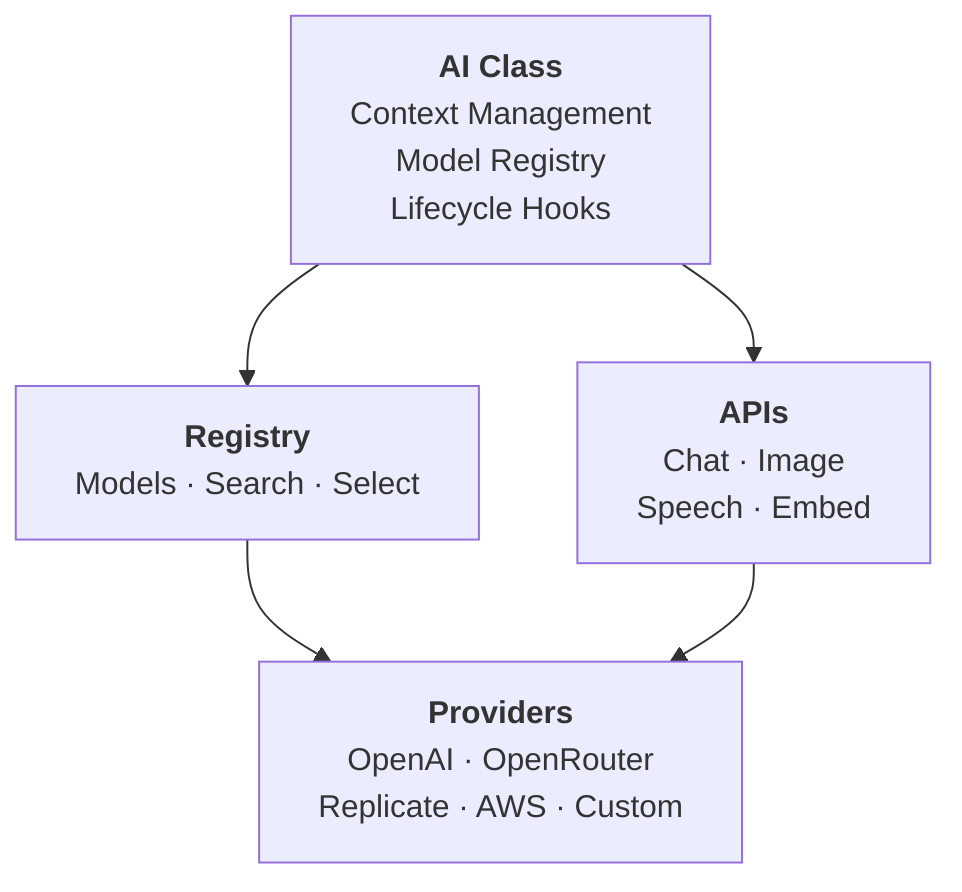

# @aeye/ai

> **Multi-provider AI library with intelligent model selection, type-safe context management, and comprehensive hooks system.**

The `@aeye/ai` package is the main AI library built on `@aeye/core`, providing a unified interface for working with multiple AI providers with automatic model selection, cost tracking, and extensible architecture.

```ts
import { AI } from '@aeye/ai';
import { OpenAIProvider } from '@aeye/openai';
import z from 'zod';

const openai = new OpenAIProvider({ apiKey: process.env.OPENAI_API_KEY! });

const ai = AI.with<MyContext>()
  .providers({ openai })
  .create({ /* defaultContext, providedContext, defaultWeights, hooks, ... */ });

// Low-level APIs
ai.chat.get(request, ctx?)           // or .stream(request, ctx?)
ai.image.generate.get(request, ctx?) // or .stream(request, ctx?)
ai.image.edit.get(request, ctx?)     // or .stream(request, ctx?)
ai.image.analyze.get(request, ctx?)  // or .stream(request, ctx?)
ai.transcribe.get(request, ctx?)     // or .stream(request, ctx?)
ai.speech.get(request, ctx?)         // or .stream(request, ctx?)
ai.embed.get(request, ctx?)
ai.models.list()  // .get(id), .search(criteria), .select(criteria), .refresh()

// Components bound to this AI instance
const myTool   = ai.tool({ name, description, schema, call, ... });
const myPrompt = ai.prompt({ name, description, content, tools, schema, ... });
const myAgent  = ai.agent({ name, description, refs, call });

myTool.run(input, ctx?)
myPrompt.run(input, ctx?)                    // streaming generator
myPrompt.get('result', input, ctx?)          // awaitable result
myPrompt.get('stream', input, ctx?)          // stream all events
myPrompt.get('streamContent', input, ctx?)   // stream text only
myAgent.run(input, ctx?)
```

## Features

- **Multi-Provider Support**: Single interface for OpenAI, OpenRouter, Replicate, AWS Bedrock, and custom providers
- **Intelligent Model Selection**: Automatic model selection based on capabilities, cost, speed, and quality
- **Type-Safe Context**: Strongly-typed context and metadata with compiler validation
- **Comprehensive APIs**: Chat, Image Generation/Analysis/Editing, Speech Synthesis, Transcription, Embeddings
- **Lifecycle Hooks**: Intercept and modify operations at every stage
- **Cost Tracking**: Automatic token usage and cost calculation
- **Streaming Support**: Full streaming support across all compatible capabilities
- **Model Registry**: Centralized model management with external sources (OpenRouter, etc.)
- **Extensible**: Custom providers, model handlers, and transformers

## Table of Contents

- [Installation](#installation)
- [Quick Start](#quick-start)
- [Architecture](#architecture)
- [Core Concepts](#core-concepts)
- [API Reference](#api-reference)
  - [Chat API](#chat-api)
  - [Image API](#image-api)
  - [Speech API](#speech-api)
  - [Transcribe API](#transcribe-api)
  - [Embed API](#embed-api)
  - [Models API](#models-api)
- [Tools, Prompts & Agents](#tools-prompts--agents)
- [Advanced Features](#advanced-features)
  - [Custom Context & Metadata](#custom-context--metadata)
  - [Lifecycle Hooks](#lifecycle-hooks)
  - [Model Selection](#model-selection)
  - [Model Sources](#model-sources)
  - [Custom Providers](#custom-providers)
  - [Extending AI Instances](#extending-ai-instances)
- [Examples](#examples)

## Installation

```bash
npm install @aeye/ai @aeye/core
```

You'll also need provider packages:

```bash
npm install @aeye/openai openai       # OpenAI
npm install @aeye/openrouter          # OpenRouter
npm install @aeye/replicate replicate # Replicate
npm install @aeye/aws                 # AWS Bedrock
```

## Quick Start

```typescript
import { AI } from '@aeye/ai';
import { OpenAIProvider } from '@aeye/openai';
import { OpenRouterProvider } from '@aeye/openrouter';

const openai = new OpenAIProvider({ apiKey: process.env.OPENAI_API_KEY! });
const openrouter = new OpenRouterProvider({ apiKey: process.env.OPENROUTER_API_KEY! });

const ai = AI.with()
  .providers({ openai, openrouter })
  .create();

// Simple chat completion
const response = await ai.chat.get({
  messages: [{ role: 'user', content: 'What is TypeScript?' }]
});
console.log(response.content);

// Streaming
for await (const chunk of ai.chat.stream({
  messages: [{ role: 'user', content: 'Write a poem' }]
})) {
  if (chunk.content) {
    process.stdout.write(chunk.content);
  }
}
```

## Architecture



## Core Concepts

### Context

Context is data passed through your entire AI operation:

- **Default Context**: Static values provided at AI creation via `defaultContext`
- **Provided Context**: Async-loaded values (e.g., from a database) via `providedContext`
- **Required Context**: Values that must be supplied per-call

```typescript
interface AppContext {
  userId: string;
  user?: User;       // loaded by providedContext
  db?: Database;     // loaded by providedContext
}

const ai = AI.with<AppContext>()
  .providers({ openai })
  .create({
    providedContext: async (ctx) => ({
      user: await db.users.findById(ctx.userId),
      db,
    }),
  });

// At call time only userId is required — the rest is loaded automatically
const response = await ai.chat.get(
  { messages: [{ role: 'user', content: 'Hi!' }] },
  { userId: 'user123' }
);
```

### Metadata

Metadata controls model selection and per-request configuration:

```typescript
interface AppMetadata {
  priority: 'cost' | 'speed' | 'quality';
}

const ai = AI.with<{}, AppMetadata>()
  .providers({ openai, openrouter })
  .create({
    defaultMetadata: { priority: 'cost' },
  });

// Override per request via context
const response = await ai.chat.get(
  { messages: [{ role: 'user', content: 'Hello' }] },
  {
    metadata: {
      model: 'openai/gpt-4o',        // pin a specific model
      weights: { cost: 0.2, speed: 0.3, accuracy: 0.5 },
      priority: 'quality',
    },
  }
);
```

## API Reference

### Chat API

**`chat.get(request, ctx?)`** — Non-streaming chat completion.

```typescript
const response = await ai.chat.get({
  messages: [
    { role: 'system', content: 'You are a helpful assistant.' },
    { role: 'user', content: 'Hello!' },
  ],
  temperature: 0.7,
  maxTokens: 1024,
});

console.log(response.content);
console.log(response.usage?.text?.input, 'input tokens');
console.log(response.usage?.text?.output, 'output tokens');
console.log(response.usage?.cost, 'cost in dollars');
console.log(response.finishReason); // 'stop' | 'length' | 'tool_calls' | ...
```

**`chat.stream(request, ctx?)`** — Streaming chat completion.

```typescript
for await (const chunk of ai.chat.stream({
  messages: [{ role: 'user', content: 'Count to 10' }]
})) {
  if (chunk.content) {
    process.stdout.write(chunk.content);
  }
  if (chunk.finishReason) {
    console.log('\nFinished:', chunk.finishReason);
  }
}
```

**Vision:**

```typescript
const response = await ai.chat.get({
  messages: [{
    role: 'user',
    content: [
      { type: 'text', content: 'What is in this image?' },
      { type: 'image', content: 'https://example.com/image.jpg' },
    ],
  }],
});
// vision capability is detected automatically from the message content
```

### Image API

**`image.generate.get(request, ctx?)`** — Generate images from a text prompt.

```typescript
const response = await ai.image.generate.get({
  prompt: 'A futuristic city at sunset',
  n: 2,
  size: '1024x1024',
  quality: 'high',
});

for (const image of response.images) {
  console.log(image.url ?? image.b64_json);
}
```

**`image.edit.get(request, ctx?)`** — Edit an image with inpainting.

```typescript
import fs from 'fs';

const response = await ai.image.edit.get({
  prompt: 'Add a sunset in the background',
  image: fs.readFileSync('photo.png'),
  mask: fs.readFileSync('mask.png'),
  size: '1024x1024',
});
```

**`image.analyze.get(request, ctx?)`** — Analyze image content (uses a vision chat model).

```typescript
const response = await ai.image.analyze.get({
  prompt: 'Describe this image in detail',
  images: ['https://example.com/photo.jpg'],
});
console.log(response.content);
```

### Speech API

**`speech.get(request, ctx?)`** — Text-to-speech synthesis.

```typescript
import fs from 'fs';
import { Readable } from 'stream';

const response = await ai.speech.get({
  text: 'Hello, this is a text-to-speech example.',
  voice: 'alloy',
  speed: 1.0,
});

// Pipe the audio stream to a file
const fileStream = fs.createWriteStream('output.mp3');
Readable.fromWeb(response.audio).pipe(fileStream);
```

### Transcribe API

**`transcribe.get(request, ctx?)`** — Speech-to-text transcription.

```typescript
import fs from 'fs';

const response = await ai.transcribe.get({
  audio: fs.readFileSync('recording.mp3'),
  language: 'en',
});

console.log(response.text);
```

### Embed API

**`embed.get(request, ctx?)`** — Generate text embeddings.

```typescript
const response = await ai.embed.get({
  texts: [
    'TypeScript is a typed superset of JavaScript',
    'Python is a high-level programming language',
  ],
});

response.embeddings.forEach(({ embedding, index }) => {
  console.log(`Text ${index}: ${embedding.length} dimensions`);
});
```

### Models API

```typescript
// List all registered models
const models = ai.models.list();

// Get a specific model
const model = ai.models.get('gpt-4o');
if (model) {
  console.log('Context window:', model.contextWindow);
  console.log('Capabilities:', Array.from(model.capabilities).join(', '));
  console.log('Input cost:', model.pricing.text?.input, 'per 1M tokens');
}

// Search with selection criteria
const results = ai.models.search({
  capabilities: new Set(['chat', 'structured']),
  weights: { cost: 0.6, speed: 0.4 },
  providers: { allow: ['openai', 'openrouter'] },
  contextWindow: { min: 100000 },
});
console.log('Best match:', results[0]?.model.id);

// Refresh model list from all sources
await ai.models.refresh();
```

## Tools, Prompts & Agents

Use `ai.tool()`, `ai.prompt()`, and `ai.agent()` to create components that are automatically wired to the AI instance (executor, streamer, and context are injected automatically).

### Tool

```typescript
import z from 'zod';

const searchKnowledge = ai.tool({
  name: 'searchKnowledge',
  description: 'Search the knowledge base for relevant information',
  instructions: 'Use this to find information relevant to the query: "{{query}}"',
  schema: z.object({
    query: z.string().describe('Search query'),
    limit: z.number().int().min(1).max(20).optional().describe('Max results (default: 5)'),
  }),
  call: async ({ query, limit = 5 }, _refs, ctx) => {
    // ctx is the full AI context including your custom fields
    return { results: await vectorSearch(query, limit) };
  },
});
```

### Prompt

```typescript
const knowledgeAssistant = ai.prompt({
  name: 'knowledgeAssistant',
  description: 'Answers questions using the knowledge base',
  content: `You are a helpful assistant. Use searchKnowledge to find information, then answer the question.

Question: {{question}}`,
  input: (input: { question: string }) => ({ question: input.question }),
  tools: [searchKnowledge],
  schema: z.object({
    answer: z.string(),
    sources: z.array(z.string()),
  }),
});

// Get structured result
const result = await knowledgeAssistant.get('result', { question: 'How does X work?' });
console.log(result?.answer);

// Stream text
for await (const text of knowledgeAssistant.get('streamContent', { question: 'How does X work?' })) {
  process.stdout.write(text);
}
```

### Agent

```typescript
const chatAgent = ai.agent({
  name: 'chatAgent',
  description: 'Chat with the user and analyze the response quality',
  refs: [searchKnowledge, knowledgeAssistant] as const,
  call: async (
    input: { userId: string; question: string },
    [search, assistant],
    ctx
  ) => {
    // Step 1: Search for relevant context
    const { results } = await search.run({ query: input.question }, ctx);

    // Step 2: Generate answer with knowledge context
    const answer = await assistant.get(
      'result',
      { question: input.question },
      { ...ctx, messages: [] }
    );

    return {
      userId: input.userId,
      question: input.question,
      answer: answer?.answer,
      sources: answer?.sources ?? [],
      contextUsed: results.length,
    };
  },
});

const result = await chatAgent.run({ userId: 'user1', question: 'What is aeye?' });
console.log(result.answer);
```

## Advanced Features

### Custom Context & Metadata

```typescript
interface AppContext {
  userId: string;
  user?: User;
  db?: Database;
}

interface AppMetadata {
  feature: 'chat' | 'analysis';
  priority: 'low' | 'normal' | 'high';
}

const ai = AI.with<AppContext, AppMetadata>()
  .providers({ openai, openrouter })
  .create({
    providedContext: async (ctx) => {
      const user = await db.users.findById(ctx.userId);
      return { user, db };
    },
    defaultMetadata: {
      priority: 'normal',
    },
  });

// At call time only userId is required
const response = await ai.chat.get(
  { messages: [{ role: 'user', content: 'Hello' }] },
  { userId: '123', metadata: { feature: 'chat' } }
);
```

### Lifecycle Hooks

```typescript
const ai = AI.with<AppContext>()
  .providers({ openai })
  .create({ /* ... */ })
  .withHooks({
    beforeModelSelection: async (ctx, request, metadata) => {
      // Adjust weights based on context (return modified metadata)
      if (ctx.user?.tier === 'free') {
        return { ...metadata, weights: { cost: 1.0 } };
      }
      return metadata;
    },

    onModelSelected: async (ctx, request, selected) => {
      console.log(`Selected: ${selected.model.id} (score: ${selected.score.toFixed(3)})`);
      // Return a modified selected model to override, or undefined to accept
    },

    beforeRequest: async (ctx, request, selected, estimatedUsage, estimatedCost) => {
      // Throw to cancel the request
      if (ctx.user && estimatedCost > ctx.user.budgetRemaining) {
        throw new Error('Insufficient budget');
      }
      console.log(
        `[${ctx.userId}] ${selected.model.id} — ` +
        `~${estimatedUsage.text?.input ?? 0} input tokens, ~$${estimatedCost.toFixed(5)}`
      );
    },

    afterRequest: async (ctx, request, response, responseComplete, selected, usage, cost) => {
      // Record actual usage
      if (ctx.user) {
        ctx.user.budgetRemaining -= cost;
        ctx.user.totalSpent += cost;
        await ctx.user.save();
      }
      console.log(
        `[${ctx.userId}] ${usage.text?.input ?? 0} in / ${usage.text?.output ?? 0} out, ` +
        `cost: $${cost.toFixed(5)}`
      );
    },

    onError: (errorType, message, error, ctx) => {
      console.error(`[AI ${errorType}] ${message}`, { error, userId: ctx?.userId });
    },
  });
```

### Model Selection

```typescript
// Cost-optimized
await ai.chat.get(
  { messages },
  { metadata: { weights: { cost: 0.9, speed: 0.05, accuracy: 0.05 } } }
);

// Quality-optimized with large context
await ai.chat.get(
  { messages },
  {
    metadata: {
      weights: { cost: 0.1, speed: 0.4, accuracy: 0.5 },
      contextWindow: { min: 128000 },
    }
  }
);

// Provider-specific
await ai.chat.get(
  { messages },
  { metadata: { providers: { allow: ['openai'], deny: ['replicate'] } } }
);

// Explicit model override
await ai.chat.get(
  { messages },
  { metadata: { model: 'openai/gpt-4o' } }
);
```

### Named Weight Profiles

```typescript
const ai = AI.with()
  .providers({ openai, openrouter })
  .create({
    weightProfiles: {
      costPriority:  { cost: 0.9, speed: 0.1 },
      balanced:      { cost: 0.4, speed: 0.3, accuracy: 0.3 },
      performance:   { cost: 0.1, speed: 0.4, accuracy: 0.5 },
    },
  });

await ai.chat.get(
  { messages },
  { metadata: { weightProfile: 'balanced' } }
);
```

### Model Sources

```typescript
import { OpenRouterModelSource } from '@aeye/openrouter';

const source = new OpenRouterModelSource({ apiKey: process.env.OPENROUTER_API_KEY });

const ai = AI.with()
  .providers({ openai, openrouter })
  .create({
    modelSources: [source],
  });

// Fetch and register all models from sources
await ai.models.refresh();
```

### Model Overrides

```typescript
const ai = AI.with()
  .providers({ openai })
  .create({
    modelOverrides: [
      {
        modelPattern: /gpt-4/,
        overrides: {
          pricing: { text: { input: 30, output: 60 } },
        },
      },
    ],
  });
```

### Strict Mode

Tool and Prompt schemas can ride the LLM's grammar-constrained strict mode for guaranteed type-safe output. Mechanics — descriptors, dialects, schema rewriting — live in [`@aeye/core`](../core/README.md#strict-mode). What `@aeye/ai` adds: model selection respects the `strict` flag (selection filters to strict-capable models when `strict: true`, scores them higher when `strict: <number>`).

Splat the curated `strictSupport` overrides from `@aeye/models` so model selection knows which models actually support strict — without it, every model defaults to lenient even when the underlying API supports strict:

```typescript
import { models, strictSupport } from '@aeye/models';

const ai = AI.with()
  .providers({ openai })
  .create({
    models,
    modelOverrides: [...strictSupport],
  });
```

`strictSupport` is a `ModelOverride[]` you can combine with your own overrides:

```typescript
modelOverrides: [
  ...strictSupport,
  { modelPattern: /gpt-4/, overrides: { tier: 'flagship' } },
],
```

### Custom Providers

Extend an existing provider or implement the `Provider<TConfig>` interface from `@aeye/core`:

```typescript
import { OpenAIProvider, OpenAIConfig } from '@aeye/openai';
import OpenAI from 'openai';

class MyProvider extends OpenAIProvider {
  readonly name = 'my-provider';

  protected createClient(config: OpenAIConfig) {
    return new OpenAI({
      apiKey: config.apiKey,
      baseURL: 'https://my-api.example.com/v1',
    });
  }
}
```

### Extending AI Instances

Share providers and configuration between multiple AI instances:

```typescript
const baseAI = AI.with<BaseContext>()
  .providers({ openai, openrouter })
  .create({ /* base config */ });

// Extend with additional context for a specific feature
interface ChatFeatureContext extends BaseContext {
  chatId: string;
  chatHistory: Message[];
}

const chatAI = baseAI.extend<ChatFeatureContext>({
  defaultContext: { chatHistory: [] },
});

const response = await chatAI.chat.get(
  { messages: [{ role: 'user', content: 'Hello' }] },
  { chatId: 'chat-123', chatHistory: [] }
);
```

## Examples

### Complete Application

```typescript
import { AI } from '@aeye/ai';
import { OpenAIProvider } from '@aeye/openai';
import { OpenRouterProvider } from '@aeye/openrouter';
import z from 'zod';

interface User {
  id: string;
  budgetRemaining: number;
  totalSpent: number;
  save: () => Promise<void>;
}

interface AppContext {
  userId: string;
  user?: User;
}

const openai = new OpenAIProvider({ apiKey: process.env.OPENAI_API_KEY! });
const openrouter = new OpenRouterProvider({ apiKey: process.env.OPENROUTER_API_KEY! });

export const ai = AI.with<AppContext>()
  .providers({ openai, openrouter })
  .create({
    providedContext: async (ctx) => ({
      user: await getUser(ctx.userId),
    }),
    defaultWeights: { cost: 0.5, speed: 0.3, accuracy: 0.2 },
    hooks: {
      beforeRequest: async (ctx, _request, selected, estimatedUsage, estimatedCost) => {
        if (ctx.user && estimatedCost > ctx.user.budgetRemaining) {
          throw new Error(
            `Estimated cost $${estimatedCost.toFixed(4)} exceeds budget ` +
            `$${ctx.user.budgetRemaining.toFixed(4)}`
          );
        }
      },
      afterRequest: async (ctx, _request, _response, _complete, _selected, usage, cost) => {
        if (ctx.user) {
          ctx.user.budgetRemaining -= cost;
          ctx.user.totalSpent += cost;
          await ctx.user.save();
        }
      },
      onError: (errorType, message, error, ctx) => {
        console.error(`[AI ${errorType}] ${message}`, { userId: ctx?.userId, error });
      },
    },
  });

// Define a tool
const webSearch = ai.tool({
  name: 'webSearch',
  description: 'Search the web for recent information',
  schema: z.object({ query: z.string() }),
  call: async ({ query }) => {
    // Integrate with a search API
    return { results: [`Result for: ${query}`] };
  },
});

// Define a research prompt
const researcher = ai.prompt({
  name: 'researcher',
  description: 'Researches a topic and provides a structured summary',
  content: `You are a research assistant. Research the following topic and provide a clear summary.

Topic: {{topic}}`,
  input: (input: { topic: string }) => ({ topic: input.topic }),
  tools: [webSearch],
  schema: z.object({
    summary: z.string(),
    keyFindings: z.array(z.string()),
    sources: z.array(z.string()),
  }),
});

// Use the prompt
async function researchTopic(userId: string, topic: string) {
  const result = await researcher.get('result', { topic }, { userId });
  return result;
}

const findings = await researchTopic('user123', 'TypeScript 5.0 features');
console.log(findings?.summary);
console.log(findings?.keyFindings);
```

## License

GPL-3.0 © [ClickerMonkey](https://github.com/ClickerMonkey)

## Links

- [Root README](../../README.md)
- [@aeye/core README](../core/README.md)
- [GitHub Repository](https://github.com/ClickerMonkey/aeye)
- [Issue Tracker](https://github.com/ClickerMonkey/aeye/issues)
